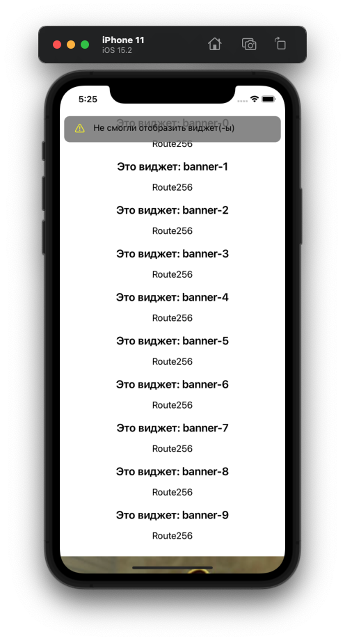
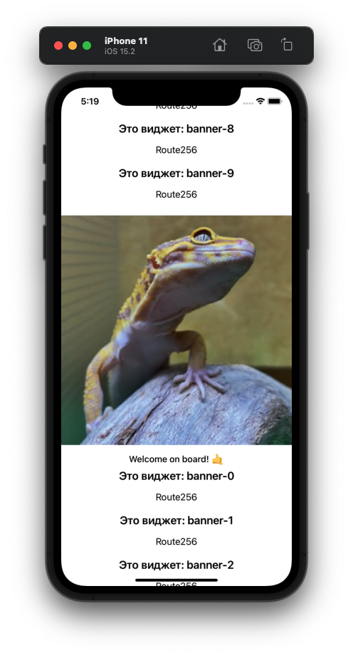

# Домашнее задание к занятию 2-2 "Composer и виджеты своими руками"

## ТЗ:
1. [x] Добавить обработку ошибок композера в `ComposerService` (используй уже готовый `enum ComposerError`).
    - Должно получиться 5 обработанных мест. `Case`'ов 4, возможно какой-то из них можно использовать несколько раз.
2. [x] Использовать `IWidgetParsingLoggingService`, чтобы сохранять информацию о нераспарсенных виджетах. (Подсказка: В `ComposerService` уже есть одноименный метод)
3. [x] Обработать ошибки из п.1 в `ComposerViewController`. А именно:
    - Если страница содержит нераспарсенные виджеты, необходимо показывать `NotificationView` с текстом `Не смогли отобразить виджет(-ы)`. См. скриншот в колонке `NotificationView`.
    - Если метод `fetchPage` отдал ошибку, то необходимо показывать `EmptyState`, передавая туда ошибку. См. скриншот в колонке `Empty State`.
        - Кнопка `Обновить` делать ничего не будет. Это доп.задание.

| NotificationView | EmptyState |
| ------ | ------ |
|  |  |

4. [x] Изменить стартовый JSON, добавив туда новый виджет после всех баннеров.
    - Вертикаль: `route256Path`
    - Название виджета: `welcome`
    - StateID: `route256-welcome`
    - Структура виджета должна содержать (см. контракт виджета в `Resources/Contracts/Welcome.proto`):
        - Структуру `items`:
            - Внутри - массив структур с одним полем `image`. 
            - Для успешной сдачи ДЗ достаточно положить туда одну структуру, где значение `image` будет `https://images.unsplash.com/photo-1620229557622-4a6d2b49a88d?fit=crop&w=300&q=50`.
        - Структуру `footer`:
            - Внутри одно поле `text` с текстом `Welcome on board! 🤙`
5. [x] Создать виджет в соответствии с примером:

| Виджет | Информация |
| ------ | ------ |
|  |     - Высота виджета равна ширине + 50. - Лейбл закреплён за боковые границы виджета, за нижнюю границу и за нижний край изображения. - Максимальное кол-во строк - `1`. - Текст в лейбле - `по центру`. - Шрифт - `bodyLBold` - Подумай, возможно получится использовать `ViewState`, чтобы было легче отображать контент виджета. |

